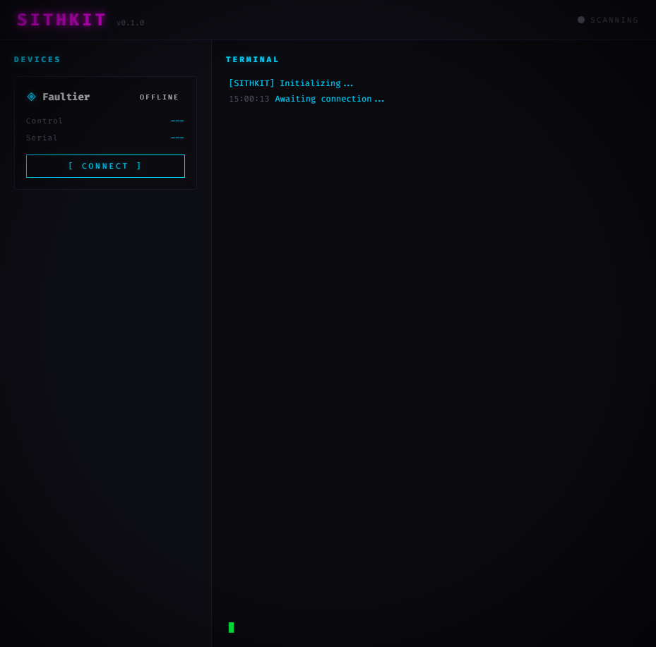

# SithKit

SithKit is a **single pane of glass** for hardware hacking. Rather than juggling a dozen terminal windows, scripts, and vendor tools, SithKit brings your hardware hacking toolkit into one place — device detection, control, and monitoring all in one place.

Built for practitioners who work with fault injection, side-channel analysis, debug probes, and other embedded hardware tooling. Plug in your devices, hit connect, and get to work.



## Current Support

| Device | Capability |
|--------|------------|
| Faultier (stacksmashing) | Detection, connection status |

More devices and capabilities coming as the toolkit grows.

## Installation

```bash
pip install faultier fastapi uvicorn
```

## Usage

```bash
python run.py
```

Opens the SithKit dashboard in your browser at `http://127.0.0.1:8000`.

Hit **[ CONNECT ]** to scan for devices. The dashboard shows live device status, port info, and a terminal log of all activity.

## Programmatic Use

```python
from sithkit.detect import find_faultier

device = find_faultier()
if device:
    print(device["serial_path"])
```

## Roadmap

- Glitcher control panel (delay, pulse, trigger config)
- ADC waveform visualization
- Power cycle controls
- Additional device support
